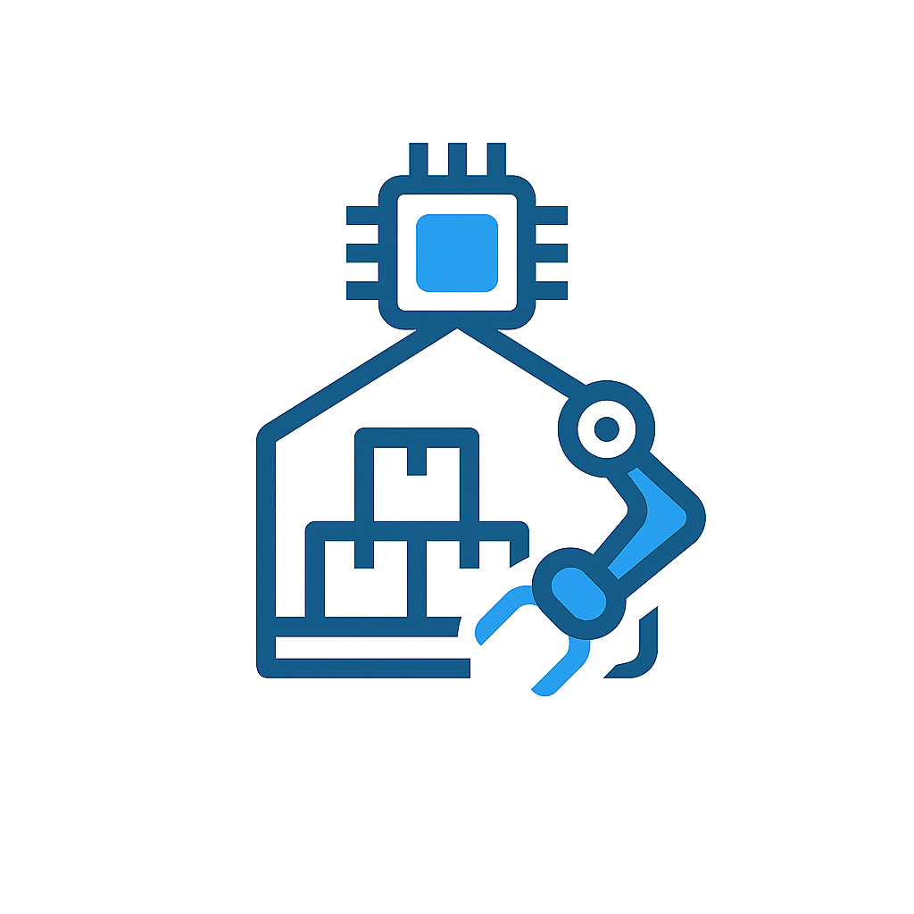

    

# Weigence

## Innovative Management Solutions for Modern Businesses

Welcome to **Weigence** – your trusted partner in comprehensive business management solutions. We specialize in developing cutting-edge client-server management software that goes beyond traditional offerings, delivering superior performance and customization for modern enterprises.

### What We Do

At Weigence, we understand that every business is unique. That's why we create **custom-tailored management systems** that perfectly align with your specific operational needs. Our expertise spans:

- **🖥️ Multi-Platform Management Software**: 
  - **Desktop Applications**: Cross-platform solutions for Windows, macOS, and Linux
  - **Mobile Applications**: Native apps for iOS and Android devices
  - **Client-Server Architecture**: Robust, scalable solutions designed for optimal performance and reliability

- **⚙️ Custom Hardware Solutions**: 
  - **ESP32-based Systems**: Custom hardware solutions built on ESP32 microcontrollers
  - **STM32 Extensions**: Expandable to STM32 platforms for enhanced performance requirements
  - **KiCAD Design**: Professional PCB design and development using KiCAD for precision engineering

- **🔧 Firmware Development**: 
  - **C/C++ Programming**: Purpose-built firmware developed in C/C++ tailored to specific hardware requirements
  - **Hardware-Optimized Code**: Firmware that maximizes efficiency and functionality for your custom hardware solutions

### Our Approach

We believe in delivering solutions that are not just functional, but transformative. Our team works closely with each client to:

- Analyze your unique business requirements
- Design and develop custom management systems
- Integrate specialized hardware components
- Provide ongoing support and optimization

### Why Choose Weigence?

- **🎯 Tailored Solutions**: Every system is built specifically for your business needs
- **🚀 Superior Performance**: Our solutions outperform generic management platforms
- **🔧 End-to-End Service**: From software development to hardware integration and firmware customization
- **💡 Innovation-Driven**: We leverage the latest technologies to give you a competitive edge
- **🤝 Partnership Approach**: We're not just vendors – we're your technology partners

---

*Empowering businesses with intelligent, custom-built management solutions that drive growth and efficiency.*
